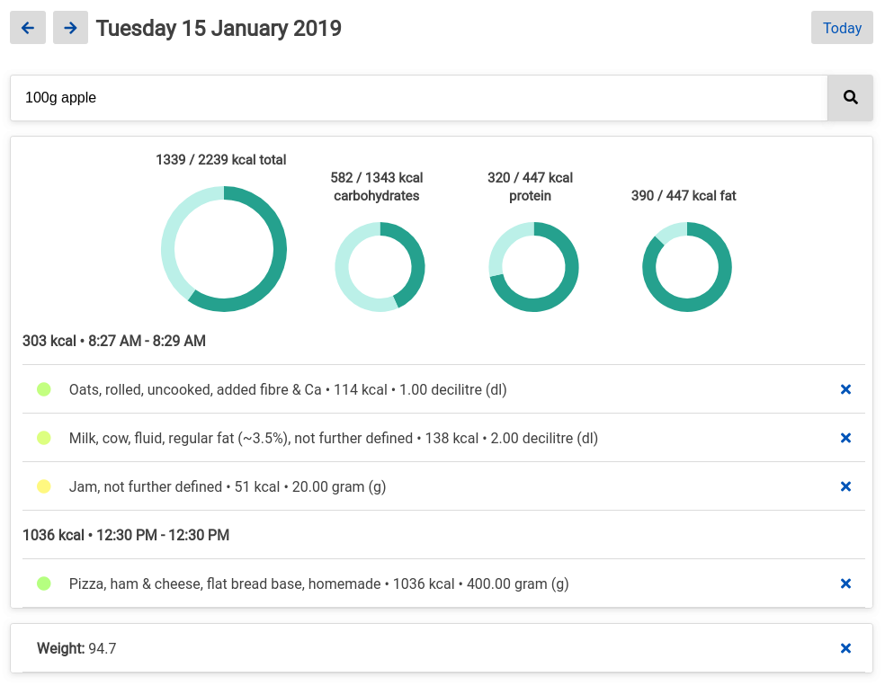

# Tiny calorie counter

# Introduction

Tiny calorie counter is a .NET core MVC application made to search and track food calories on a daily basis. The project is somewhat abandoned, though might contain some interesting code for those interested. 

# Running

Clone the repository and open the folder in Visual Studio Code, and run it from there. Or navigate to the cloned folder with the terminal/console and run: `dotnet run`. The application is then running on the url: https://localhost:5001.